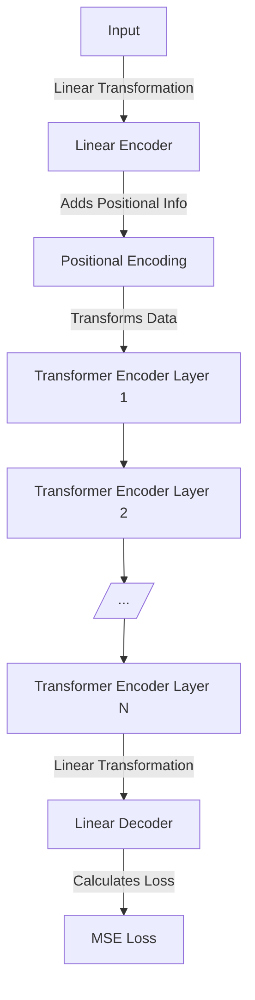

# Neural Network Architectures

<span class="text-sm">

| WaveNet | Temporal Convolutional Networks (TCNs) | Recurrent Neural Networks (RNNs) | State Transition Networks |
|---------|----------------------------------------|---------------------------------|---------------------------|
| A deep neural network for generating raw audio waveforms, known for its high fidelity in text-to-speech and musical applications. | A type of convolutional neural network designed to handle sequence data by capturing temporal dependencies. | Neural networks with loops to allow information persistence, suitable for handling sequence data like time-series or text. | Networks modeling the transitions between states in a system, often used to learn and represent dynamic behaviors. |
| - Utilizes causal dilated convolutions. <br> - Capable of modeling temporal dependencies in data. <br> - High-quality audio generation. | - Employs dilated convolutions for long-range dependencies. <br> - Efficient and parallelizable architecture. <br> - Often used in tasks like sequence modeling and time-series prediction. | - Processes sequences step-by-step, maintaining an internal state. <br> - Suited for tasks like language modeling, speech recognition. <br> - Variants include LSTM and GRU. | - Captures state transitions in a structured manner. <br> - Suitable for tasks with clear state dynamics, like robotics or control systems. <br> - Can be integrated with other architectures for complex modeling. |

</span>

---

<span class="text-sm">

## ToneX by IK Multimedia
ToneX is a software by IK Multimedia designed for creating, playing, and sharing Tone Models of amps, cabinets, combos, and pedals. It utilizes AI Machine Modeling technology to model the sound of any amp, cabinet, combo or pedal with high sonic accuracy. The ToneX ecosystem is enriched by the IK Multimedia's Capture system, allowing users to turn their real amps, cabs, pedals, and full rigs into their own Tone Models in minutes.

## BABY Audio TAIP
BABY Audio's TAIP is a tape emulation VST plugin that brings the true sound and behavior of analog tape into digital audio workstations. Described as a faithful AI-based emulation of a 1971 European tape machine, TAIP is ...

## Other Similar Plugins
- **Baby Audio Crystalline**: An algorithmic reverb plugin exploring the limits of reverb effect, offers features like BPM-synced reverberations and a depth section for modulating reverb respons.
- **Baby Audio Comeback Kid**: An award-winning analog delay plugin, with unique delay effects to enhance audio tracks.

</span>

---

<span class="text-sm">

## Progress Update: Tackling Remaining Challenges
<br>

#### Addressed in Part 1:
- Computationally Expensive ✅
- Hard to Implement ✅

#### Addressing in Part 2:
- **Sample Rate Conversions:** 
    - Implemented efficient resampling algorithms to handle different sample rates seamlessly.
    - Integrated real-time resampling to accommodate dynamic sample rate changes during processing.

- **Control Parameters:** 
    - Developed a robust parameter mapping system to translate user controls to processing parameters accurately.
    - Introduced an intuitive user interface for real-time control, ensuring a responsive and user-friendly experience.

### Benefits:
- **Enhanced Flexibility:** Seamless handling of different sample rates and intuitive control over parameters.
- **Improved Usability:** Reduced complexity in managing sample rate conversions and control parameters.
- **Optimized Performance:** Lower computational load and latency thanks to efficient resampling and parameter management.

</span>

---

# Overdrive Circuit RNN Implementation


---
class: flex justify-center items-center
---

# LACTOSE

---

# Conditional Models & LACTOSE Algorithm
<div grid="~ cols-2 gap-4">
<div>

<span class="text-sm">

### Background/Overview
- Some ML methods do not require backpropagation (Markov Modelling, Decision Trees)
- Proposed methods
  - Conditional Modelling (CM) -  Conditional Random Fields (CRF)
  - Conditional Neural Processes (CNP) - similar to Gaussian Process/Bayesian Methods
  - Conditional VAEs | Conditional seq2seq

</span>
</div>
<div>

### Difficulties in Conditional Models

- Traditional neural networks struggle with conditional statements within the graph.
- Backpropagation is hindered by branching conditions.
- Conditional statements present unique challenges, especially in the circunmstances presented in audio.
</div> 
</div>


---

<div grid="~ cols-2 gap-4">
<div>

# Addressing with LACTOSE
- Linear Array of Conditions, TOpologies with Separated Error-backpropagation (LACTOSE)
- LACTOSE enables differentiable "if" conditions, which can allow the use of these in various architectures.
- Employs a dynamic parameter loading strategy during prediction.
- In theory, this would allow each model to be smaller in size -- Needs to bound less parameter space

</div>

  <div>

<figure style="margin-left:auto;margin-right:auto;width:70%">
<!--  -->
    
    <figcaption>A visualisation of model parameter space encompassing vs. separated conditions.</figcaption>
</figure>
    

  </div>
</div>


---


<div grid="~ cols-2 gap-4">
<div>

<span class="text-sm">

# LACTOSE Algorithm in Practice
- Overcomes issues with non-zero gradients in conditional branches.
- Conditions and model parameters are stored externally to the Tensorflow graph.

</span>

$$
\begin{equation}
    y = \begin{cases}
        0.25x - 0.25  & \text{if } x \leq -0.5         \\
        0.5x  - 0.125 & \text{if } -0.5 < x \leq -0.25 \\
        x             & \text{if } -0.25 < x \leq 0.25 \\
        0.5x + 0.125  & \text{if } 0.25 < x \leq 0.5   \\
        0.25x + 0.25  & \text{if } x > 0.5
    \end{cases}
\end{equation}
$$

Dataset was prepared 7.2e5 samples, LACTOSE model: 4x4, non-LACTOSE 8x8. 4x4 non-LACTOSE was not able to train. ReLU activation fn. 
</div>

<div>


``` c
While Train==True:
  // ModelInput: x
  // ModelOutput: y
  IF x = C_n // check across all conditions
  RETURN θ_n
  ENDIF

  Model <-- θ_n
  Prediction ^y = Model(x, θ_n)
  Loss = LossFunction(y, ^y)
  Optimizer <-- Loss
  Save(ModelParams: C_n)

```
</div>

</div>

---

# LACTOSE Results & Computational Cost
<div grid="~ cols-2 gap-4">
<div>
<span class="text-sm">

- Evaluated on a dataset with a piecewise linear transfer function.
  - Noticed that this works best for static nonlinearities, in order to keep the model size small.

- 720,000 samples split into 80% training, 20% testing.
- Outperforms an MLP in efficiency with reduced parameter space.

| Model   | Total Duration   | Mean Duration/Samp. | Realtime Score   |
|---------|------------------|---------------------|------------------|
| LACTOSE | 1.87e-2 seconds  | 1.62e-10 seconds    | 535.48×          |
| MLP     | 3.80e-2 seconds  | 3.3e-10 seconds     | 263.00×          |


</span>
</div>

<div>


This benchmark was produced on a 2018 Mac Mini, with a 3.2 GHz 6-core Intel Core i7 CPU with AVX instructions enabled (RTNeural).
</div>
</div>


---
class: flex justify-center items-center
---

# Transformer Model

---


<div grid="~ cols-3 gap-4">
<div>

## Transformer Model

</div>

<div>

<span class="text-sm">

##### Linear Encoder
- A dense layer that projects the input features into a higher-dimensional space suitable for the transformer.

##### Positional Encoding (PE)
- Infuses the input with positional data to maintain sequence information.

##### Transformer Encoder Layers
- Comprised of N layers (in this case, 8), each transformer encoder layer further processes the data, applying self-attention mechanisms and feedforward neural networks.

##### Linear Decoder
- Converts the high-dimensional output of the last encoder layer back into the original feature space, in this case, predicting a single continuous value.

</span>

</div>

<div>

<span class="text-sm">

##### Sine-cosine PE
- Sine-cosine positional encoding gives unique positional identifiers to sequence elements using alternating sine and cosine functions, enabling a model to understand the order of inputs.

- Applied to audio, this allows the model to recognize the order and temporal markers associated to the audio samples.

</span>
</div>

</div>

---

## Transformer Results and Discussion
<span class="text-sm">

- Transformers are typically known for their generative ability. However, in the case of learning the mapping of the Tubescreamer clipping stage, the results show that more work was necessitated. The above image is a smaller transformer (2 enc layers, dim=4) and the bottom is a larger transformer (8 enc layers, dim=8)

</span>


<span class="text-sm">

- These results indicate that a larger transformer model is required to model the underlying mapping of the clipping stage. Or datum that span a larger distribution of the required space.

- Note on Generative Ability: Although the replication of the TS clipping stage might not be as good as other models, it is possible that there are other latent abilities the transformer model is capable of, even at low parameter count.

</span>

---


