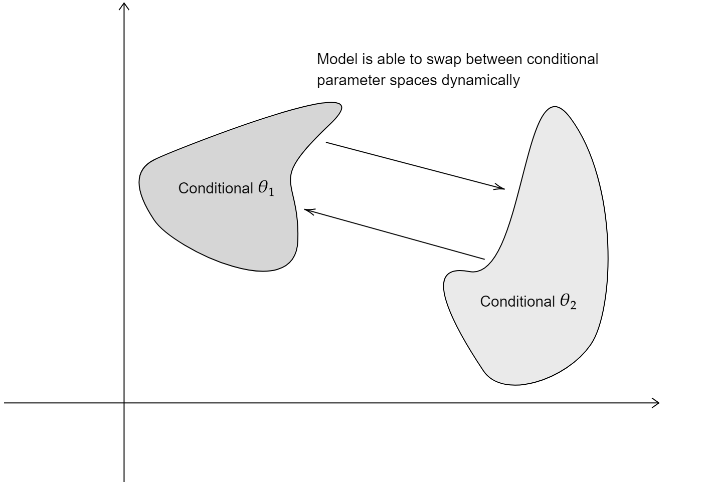
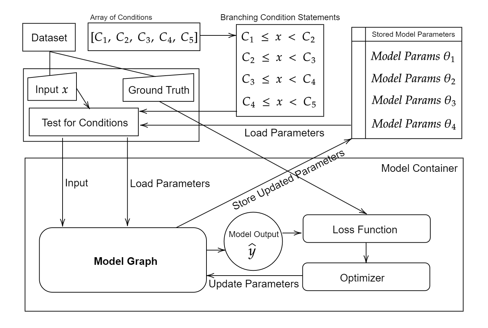

# Neural Network Architectures

| WaveNet | Temporal Convolutional Networks (TCNs) | Recurrent Neural Networks (RNNs) | State Transition Networks |
|---------|----------------------------------------|---------------------------------|---------------------------|
| A deep neural network for generating raw audio waveforms, known for its high fidelity in text-to-speech and musical applications. | A type of convolutional neural network designed to handle sequence data by capturing temporal dependencies. | Neural networks with loops to allow information persistence, suitable for handling sequence data like time-series or text. | Networks modeling the transitions between states in a system, often used to learn and represent dynamic behaviors. |
| - Utilizes causal dilated convolutions.   - Capable of modeling temporal dependencies in data.   - High-quality audio generation. | - Employs dilated convolutions for long-range dependencies.   - Efficient and parallelizable architecture.   - Often used in tasks like sequence modeling and time-series prediction. | - Processes sequences step-by-step, maintaining an internal state.   - Suited for tasks like language modeling, speech recognition.   - Variants include LSTM and GRU. | - Captures state transitions in a structured manner.   - Suitable for tasks with clear state dynamics, like robotics or control systems.   - Can be integrated with other architectures for complex modeling. |

---

## ToneX by IK Multimedia
ToneX is a software by IK Multimedia designed for creating, playing, and sharing Tone Models of amps, cabinets, combos, and pedals. It utilizes AI Machine Modeling technology to model the sound of any amp, cabinet, combo or pedal with high sonic accuracy. The ToneX ecosystem is enriched by the IK Multimedia's Capture system, allowing users to turn their real amps, cabs, pedals, and full rigs into their own Tone Models in minutes.

## BABY Audio TAIP
BABY Audio's TAIP is a tape emulation VST plugin that brings the true sound and behavior of analog tape into digital audio workstations. Described as a faithful AI-based emulation of a 1971 European tape machine, TAIP is ...

## Other Similar Plugins
- **Baby Audio Crystalline**: An algorithmic reverb plugin exploring the limits of reverb effect, offers features like BPM-synced reverberations and a depth section for modulating reverb respons.
- **Baby Audio Comeback Kid**: An award-winning analog delay plugin, with unique delay effects to enhance audio tracks.

---

## Progress Update: Tackling Remaining Challenges
 

#### Addressed in Part 1:
- Computationally Expensive ✅
- Hard to Implement ✅

#### Addressing in Part 2:
- **Sample Rate Conversions:** 
    - Implemented efficient resampling algorithms to handle different sample rates seamlessly.
    - Integrated real-time resampling to accommodate dynamic sample rate changes during processing.

- **Control Parameters:** 
    - Developed a robust parameter mapping system to translate user controls to processing parameters accurately.
    - Introduced an intuitive user interface for real-time control, ensuring a responsive and user-friendly experience.

### Benefits:
- **Enhanced Flexibility:** Seamless handling of different sample rates and intuitive control over parameters.
- **Improved Usability:** Reduced complexity in managing sample rate conversions and control parameters.
- **Optimized Performance:** Lower computational load and latency thanks to efficient resampling and parameter management.

---

# Conditional Models & LACTOSE Algorithm
### Background Overview

---

# Difficulties in Conditional Models
- Traditional neural networks struggle with conditional statements within the graph.
- Backpropagation is hindered by branching conditions.
- LACTOSE stores parameters for numerical ranges, handling separate error backpropagation.

Note: Conditional statements present unique challenges, especially in DDSP.

---

# Addressing with LACTOSE
- LACTOSE enables differentiable "if" conditions, crucial for DDSP.
- Employs a dynamic parameter loading strategy during prediction.

 

<figure style="margin-left:auto;margin-right:auto;width:50%">
<!--  -->
    
    <figcaption>A visualisation of dimension-reduced model parameter space encompassing all conditions.</figcaption>
</figure>

---

# Beyond LACTOSE
- Decision Trees & Markov Models bypass the issue (no error-backpropagation needed).
- Conditional Neural Processes (CNPs) and Variational Autoencoders also utilize conditions.
- The model parameter space increases with more separated conditions.

<figure>
  
  <figcaption>Separated parameter spaces for each condition in LACTOSE.</figcaption>
</figure>

---

# LACTOSE Algorithm in Practice
- Overcomes issues with non-zero gradients in conditional branches.
- Implemented in Tensorflow, it uses an array of conditions and a dataset as input.
- Conditions and model parameters are stored externally to the Tensorflow graph.

<figure>
  
  <figcaption>Procedures behind the LACTOSE algorithm with an external conditions host.</figcaption>
</figure>

---

# LACTOSE Results & Computational Cost
- Evaluated on a dataset with a piecewise linear transfer function.
- 720,000 samples split into 80% training, 20% testing.
- Outperforms an MLP in efficiency with reduced parameter space.

<figure>
  
  <figcaption>Piecewise linear function used for testing LACTOSE.</figcaption>
</figure>

Note: LACTOSE addresses computational inefficiencies in models with conditional branching.

