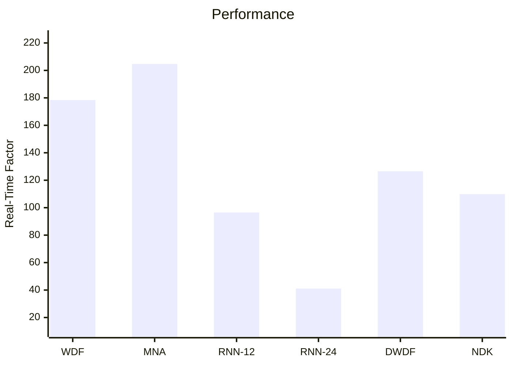

# Performance Comparison

<v-clicks depth="2">

- White-box models can be _very_ fast.
- Black-box models can achieve good performance, but larger models are slower.
- Grey-box models often fall somewhere in-between.
- YMMV depending on the circuit being modelled and the accuracy required.
- Trade-offs (Accuracy vs. speed):
  - Iterative solver constraints (white-box only)
  - Maths function approximations
  - Neural network size

</v-clicks>

---

# Takeaways

<v-clicks depth="2">

- White-Box circuit modelling techniques
  - Modified Nodal Analysis
  - Nodal DK
  - Wave Digital Filters
  - And others! (Port-Hamiltonian, Nodal State Space, ...)
- Black-Box circuit modelling techniques
  - Neural Networks (convolutional networks, recurrent networks, transformers, conditional networks)
  - And others! (Volterra Kernels, dynamic convolution, ...)
- Grey-Box circuit modelling techniques
  - Symbolic Representations
  - Integrations with white-box modelling techniques
  - Physics approximating networks
  - And others! (active research area)

</v-clicks>

---

# Takeaways

<v-clicks depth="3">

- **Which circuit modelling technique should I use for ________ circuit?**
  - It depends! Consider...
  - What kind of circuit is it?
  - Do you want to be able to "tweak" and "modify" the model?
  - Accuracy and performance goals

</v-clicks>
 
<v-clicks depth="3">

- Some advice:
  - Small models can be very fast, but optimizing your model may take _significant_ effort.
  - Understanding your circuit better will _always_ result in a better model.
  - Think about what _you_ want out of making a circuit model.
  - Don't be afraid to make something new!

</v-clicks>
