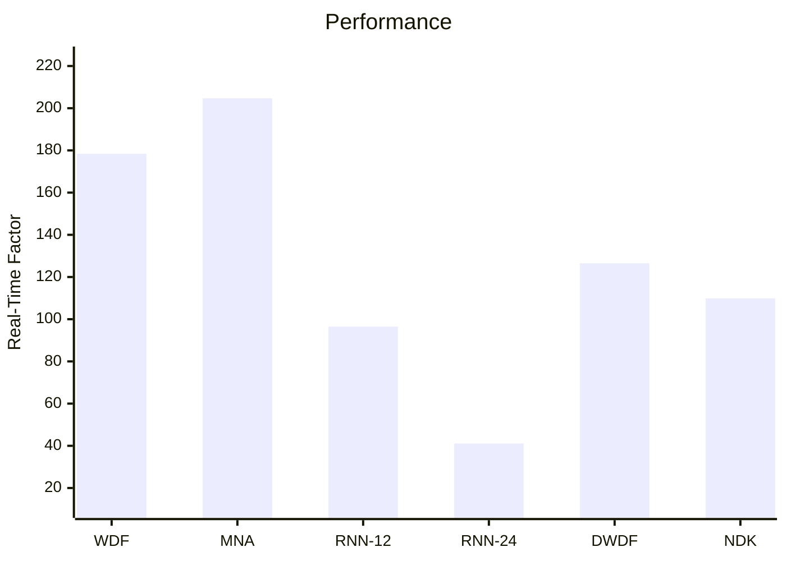

# Performance Comparison

<v-clicks depth="2">

- White-box models can be _very_ fast.
- Black-box models can achieve good performance, but larger networks are slower.
- Grey-box models often fall somewhere in-between.
- YMMV depending on the circuit being modelled and the accuracy required.
- Trade-offs (Accuracy vs. speed):
  - Iterative solver constraints
  - Function approximations
  - Neural network size

</v-clicks>

